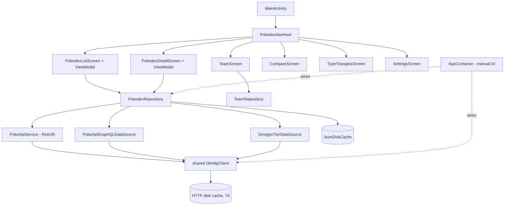
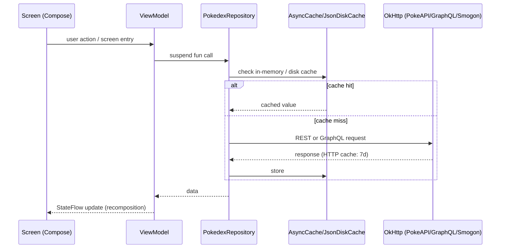

# Architecture

## Overview
PikaDex is a single-module Android app: a Pokédex client for [PokeAPI](https://pokeapi.co/) with team-building and type-matchup tools. Jetpack Compose UI, no backend of its own.

## Tech stack
- **Kotlin + Jetpack Compose** — UI and app logic, single `:app` module (no multi-module split; codebase size doesn't warrant one).
- **Retrofit + OkHttp + Gson** — REST calls to PokeAPI. A hand-rolled GraphQL data source (`PokeApiGraphQLDataSource`, raw OkHttp POST, no GraphQL client lib) bulk-fetches list data PokeAPI's REST endpoints would otherwise need ~1300 individual requests for.
- **Navigation Compose** — single-Activity, `NavHost`-based screen routing.
- **Coil** (+ `coil-gif`) — sprite/artwork loading, including animated Showdown battle sprites.
- **No DI framework** — `AppContainer`, a plain `object` singleton, wires the one repository by hand; see Core components.

## Directory structure
```
app/src/main/java/com/mandallaz/pikadex/
├── MainActivity.kt          # single Activity, theme + locale wrapper, hosts NavHost
├── PikaDexApplication.kt    # Application: calls AppContainer.init()
├── data/                    # repository, caches, settings, DI container
│   ├── remote/               # Retrofit service, GraphQL data source, DTOs
│   └── repository/           # PokedexRepository: the one data-access seam
├── navigation/               # PokedexNavHost: routes + bottom nav
├── ui/                       # one package per screen (list, detail, team, compare,
│                              # typechart, settings) + shared components/, theme/
└── util/                     # pure helper functions (type effectiveness, team math,
                               # localization, sprites, evolution/rarity logic)
```

## Core components


- **AppContainer** — process-lifetime singleton (`object`); builds the shared `OkHttpClient`, Retrofit instance and `PokedexRepository`. No DI framework.
- **PokedexRepository** — the single data-access seam (`PokedexRepositoryApi` interface extracted for ViewModel unit tests). Combines REST, GraphQL and Smogon fetches; caches global lists (pokémon/moves/abilities/types, ~1300 entries) in memory for process lifetime, per-pokémon detail data behind bounded caches.
- **Screen + ViewModel per feature** (`ui/list`, `ui/detail`, `ui/team`, `ui/compare`, `ui/typechart`, `ui/settings`) — standard Compose screen/ViewModel pairing, each ViewModel taking the repository via constructor injection.
- **`TeamRepository`, `FavoritesRepository`, `*Settings` objects** — other `data/` singletons; unlike `PokedexRepository` they're not behind an interface, since each no-ops safely to a sane default when its `init(Context)` hasn't run (true in JVM unit tests).

## Data flow

Every network path shares one `OkHttpClient` (one connection pool, one on-disk HTTP cache) regardless of whether the call goes through Retrofit, the raw GraphQL POST, or the Smogon fetch.

## Key design decisions
- **7-day HTTP cache TTL, well beyond PokeAPI's own max-age** — the data is effectively static between app sessions; there's no reason to re-hit the network just because a CDN header meant for a high-traffic API expired on a single mobile client.
- **GraphQL bulk-fetch instead of ~1300 REST calls** — PokeAPI's REST endpoints only return one resource at a time; the hand-rolled GraphQL data source fetches base stats, names and move info for the whole dex in a handful of requests.
- **Manual DI over a framework** — one repository, one process-lifetime container; Hilt/Koin would add build-time and indirection with nothing to show for it at this scale.
- **Debug-signed release fallback** — a release build with no `keystore.properties` (fresh checkout, dev machine) still builds and installs, signed with the debug key and a `-debugsigned` version suffix, rather than failing the build outright (see `app/build.gradle.kts`).
- **`PokedexRepositoryApi` interface exists only for `PokedexRepository`** — it's the one class ViewModels need a test double for; the other `data/` singletons don't need the same treatment (see above).

## External integrations
- **PokeAPI** (REST + GraphQL) — the core data source: pokémon, species, moves, abilities, types, evolution chains.
- **Smogon** — competitive tier data (`SmogonTierDataSource`) and outbound links from the detail screen (via Custom Tabs).
- **code-review-graph** (MCP server, `.mcp.json`) — local dev tool, not shipped in the app; used for codebase exploration/review during development.
